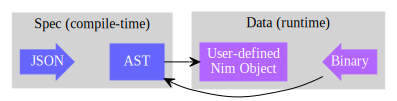

# <p align="center">nimitai</p>

## Introduction
Nimitai is a compile-time parser generator for binary data. It transforms JSON objects into parsing procedures.  
Each input object should describe a binary format according to [Kaitai Struct](https://kaitai.io/) conventions.

| Exported symbol | Production |
|-----------------|------------|
| `macro injectParser(spec: static[JsonNode])` | static library (compile time code embedding) |
| `proc createDynlib(spec: JsonNode, path: string)` | dynamic library |
| `proc outputModule(spec: JsonNode): string` | nim module (source code) |

## Writing specs
Being ubiquitous and easily parsable, JSON is a great base format, and there is even a CT parser [in Nim stdlib](https://nim-lang.org/docs/json.html).

However, writing in JSON is not appealing at all. Luckily there are a couple of nice JSON superset, and Nimitai can work in conjuction with any CT parser that outputs `JsonNode`, ideally YAML for compatibility with [Kaitai Struct specs](https://formats.kaitai.io/).

Sadly we don't have such a parser for Nim currently. In fact, this is the very reason this project has been completely stuck, making zero progress for almost a year now. Screw you YAML!  

Since Nimitai _now_ uses JSON as its input format, it can progress independently of a YAML parser implementation. Moreover, I believe working on such an implementation is bad idea, given how complex YAML is. Currently the plan is to implement a **[UCL](https://github.com/vstakhov/libucl) parser instead**, which is a fair compromise. UCL looks like nginx configuration syntax. Work towards this is in progress at a seperate [repo](https://github.com/sealmove/ucl).



## Advantages over Kaitai Struct
1. **High quality idiomatic Nim code generation at the AST level**  
Something I couldn't achieve for Nim with Kaitai Struct because it's made with Java-like languages in mind. After all, Kaitai Struct is not as language-agnostic as it claims to be.
2. **Pluggable spec-as-compiler**  
The main selling point. Instead of being an external compiler, Nimitai is a CT library which means you don't have to mess with makefiles or similar mechanisms - everything is done within the language. The moment you tweak your spec, your project that links to it has a brand new compiler! No scripts needed at all.

## UCL example

hello_world.ucl
```yaml
meta {
  id: hello_world
  endian: le;
}

seq {
  id: len1;
  type: u4;
}
seq {
  id: block1;
  type: block;
  size: len1;
}
seq {
  id: len2;
  type: u4;
}
seq {
  id: block2;
  type: block;
  size: len2;
}
seq {
  id: finisher;
  type: u4;
}

types {
  block {
    seq {
      id: number1;
      type: u4;
    }
    seq {
      id: number2;
      type: u4;
    }
  }
}
```

hello_world.bin (hex view)
```bin
10 00 00 00 42 00 00 00 43 00 00 00 ff ff ff ff
ff ff ff ff 08 00 00 00 44 00 00 00 45 00 00 00
ee 00 00 00
```
hello_world.nim
```nim
import json, ucl, nimitai, kaitai_struct_nim_runtime
injectParser(parseUcl(readFile"hello_world.ucl"))
let x = HelloWorld.fromFile("hello_world.bin")

echo "Block1, number1: " & toHex(x.block1.number1.int64, 2)
echo "Block1, number2: " & toHex(x.block1.number2.int64, 2)
echo "Block2, number1: " & toHex(x.block2.number1.int64, 2)
echo "Block2, number2: " & toHex(x.block2.number2.int64, 2)
```
output:
```
Block1, number1: 42
Block1, number2: 43
Block2, number1: 44
Block2, number2: 45
```
